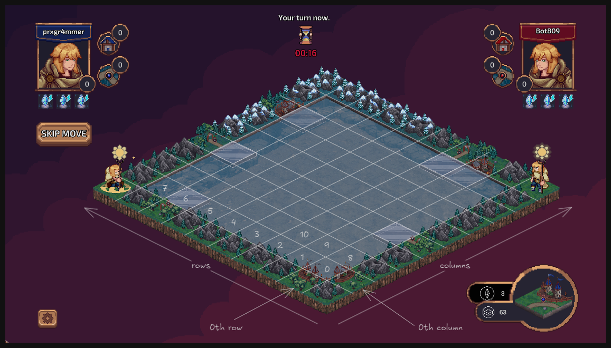

# Board 

This document explains the core concept of the Board model in Mage Duel - how it represents the game state, what each field means, and how to work with it effectively.

## Overview

The Board model is the heart of Mage Duel's game state. It represents a complete game session between two players, tracking everything from tile placement to scoring, from deck state to game progression. Think of it as a snapshot of an entire game at any given moment.

---

## Board Structure Deep Dive

```cairo
#[derive(Drop, Serde, Debug, Introspect, Clone)]
#[dojo::model]
pub struct Board {
    #[key]
    pub id: felt252,
    pub initial_edge_state: Span<u8>,
    pub available_tiles_in_deck: Array<u8>,
    pub top_tile: Option<u8>,
    pub state: Array<(u8, u8, u8)>,
    pub player1: (ContractAddress, PlayerSide, u8),
    pub player2: (ContractAddress, PlayerSide, u8),
    pub blue_score: (u16, u16),
    pub red_score: (u16, u16),
    pub last_move_id: Option<felt252>,
    pub game_state: GameState,
    pub moves_done: u8,
    pub last_update_timestamp: u64,
}
```

---

## Field-by-Field Explanation

### Game Identity
#### `id: felt252` 
**What it is:** Unique identifier for this specific game board.

**Why it matters:** 
- Primary key for database lookups
- Links all game-related data (moves, snapshots, scoring)
- Generated incrementally by board_id_generator

**Example Usage:**
```cairo
let board: Board = world.read_model(board_id);
```

---

### Board Layout System
#### `initial_edge_state: Span<u8>`
**What it is:** The starting configuration of the board's edges before any tiles are placed.

**Structure:** 32 elements representing 4 sides × 8 positions per side
```
Side 0 (Bottom):    [positions 0-7]
Side 1 (Right):  [positions 8-15] 
Side 2 (Top): [positions 16-23]
Side 3 (Left):   [positions 24-31]
```


**Edge Types:**
- `TEdge::C` (0): City - only connects to city edges
- `TEdge::R` (1): Road - only connects to road edges
- `TEdge::M` (2): Mountain - neutral, connects to anything

**Why it's important:**
- Defines scoring boundaries for edge-adjacent tiles
- Creates consistent starting conditions
- Enables tile placement validation

**Example:**
```cairo
// Edge state for a board with 1 city and 1 road per side
initial_edge_state = [
    0, 2, 2, 1, 2, 2, 2, 2,   // Bottom: city at pos 0, road at pos 3
    2, 0, 1, 2, 2, 2, 2, 2,   // Right: city at pos 9, road at pos 10
    2, 0, 2, 2, 1, 2, 2, 2,   // Top: city at pos 17, road at pos 20
    2, 1, 2, 2, 2, 2, 2, 1,   // Left: city at pos 31, road at pos 25
]
```


#### `state: Array<(u8, u8, u8)>`
**What it is:** The current state of all 64 board positions (8×8 grid).

**Tuple Structure:** `(tile_type, rotation, player_side)`
- `tile_type`: Which tile is placed (or `Tile::Empty` for empty positions)
- `rotation`: Tile rotation 0-3 (0°, 90°, 180°, 270°)
- `player_side`: Which player placed it (`PlayerSide::Blue` or `PlayerSide::Red`)

**Position Mapping:**


**Example State:**
```cairo
state = [
    (24, 0, 0),     // Position 0: Empty
    (5, 2, 1),      // Position 1: Tile type 5, rotated 180°, placed by Red
    (17, 3, 0)      // Position 2: Tile type 17, rotated 270°, placed by Blue
    (24, 0, 0),     // Position 3: Empty
    // ... 62 more positions
]
```

---

### Deck Management
#### `available_tiles_in_deck: Array<u8>`
**What it is:** All tiles that can still be drawn from the deck.

**Content:** Flattened array where each element represents one drawable tile
```cairo
// If rules specify: [2 of tile_0, 1 of tile_1, 3 of tile_2, ...]
// Then available_tiles_in_deck = [0, 0, 1, 2, 2, 2, ...]
```

**How it changes:**
- Decreases when tiles are drawn
- Can increase when tiles are returned (redraw, snapshots)
- Empty array = no more tiles available

#### `top_tile: Option<u8>`
**What it is:** The tile currently revealed and available for placement.

**States:**
- `Some(tile_id)`: A tile is available for the current player
- `None`: Deck is empty, no tile available

**Behavior:**
- Updated when tiles are drawn
- Used for tile placement validation
- Critical for determining game end conditions

---

### Player Management
#### `player1: (ContractAddress, PlayerSide, u8)`
#### `player2: (ContractAddress, PlayerSide, u8)`

**Tuple Structure:** `(address, side, joker_count)`

**Player Assignment:**
- `player1`: Usually the host (game creator)
- `player2`: Usually the guest (game joiner)

**Side Assignment:**
- Typically: player1 = Blue, player2 = Red
- But can vary in snapshot games

**Joker Count:**
- Starts with value from Rules (usually 3)
- Decreases when jokers are used
- Cannot make joker moves when count = 0

**Example:**
```cairo
player1 = (0x123..., PlayerSide::Blue, 2),    // 2 jokers remaining
player2 = (0x456..., PlayerSide::Red, 3),     // 3 jokers remaining
```

---

### Scoring System
#### `blue_score: (u16, u16)`
#### `red_score: (u16, u16)`

**Tuple Structure:** `(city_points, road_points)`

**Scoring Types:**
- **City Points**: From completed cities and city-adjacent features
- **Road Points**: From completed roads and road networks
- **Final Score**: city_points + road_points + (unused_jokers × joker_price)

**How Scores Update:**
- Immediate points when tiles are placed
- Bonus points when features are completed
- Contest resolution when multiple players contribute
- Final joker bonus at game end

**Example Progression:**
```cairo
// After player places city tile
blue_score = (8, 3),  // 8 city points, 3 road points
red_score = (5, 7),   // 5 city points, 7 road points

// After completing a contested city
blue_score = (11, 3), // +3 from winning the city contest
red_score = (2, 7),   // -3, lost the contest
```

---

### Game Flow Control
#### `last_move_id: Option<felt252>`
**What it is:** Reference to the most recent move made in this game.

**Purpose:**
- Links to Move model for move history
- Enables move chain traversal (event sourcing)
- Used for turn validation and timing

**States:**
- `None`: No moves made yet (fresh game)
- `Some(move_id)`: Points to latest Move model

#### `moves_done: u8`
**What it is:** Counter of total moves made in the game.

**Uses:**
- Quick reference for game progress
- Snapshot creation validation
- Game phase determination
- Performance optimization (avoid counting move chain)

#### `game_state: GameState`
**What it is:** Overall state of the game.

**Values:**
- `GameState::InProgress`: Game is active, moves can be made
- `GameState::Finished`: Game has ended, no more moves allowed

---

### Timing Management
#### `last_update_timestamp: u64`
**What it is:** Block timestamp of the last game action.

**Purpose:**
- Move timeout enforcement (players have limited time)
- Automatic game ending after inactivity
- Turn validation (whose turn is it?)

**Timing Rules:**
```cairo
const MOVE_TIME: u64 = 65; // 65 seconds per move

// If time_delta > MOVE_TIME: opponent's turn
// If time_delta > 2 * MOVE_TIME: can force game end
```

---

## Working with the Board Model

### Reading Board State

```cairo
// Get complete board
let board: Board = world.read_model(board_id);

// Check if game is active
if board.game_state == GameState::InProgress {
    // Game is ongoing
}

// Get current scores
let (blue_cities, blue_roads) = board.blue_score;
let (red_cities, red_roads) = board.red_score;
let blue_total = blue_cities + blue_roads;
let red_total = red_cities + red_roads;
```

### Checking Tile Placement

```cairo
// Check what's at a specific position
let position = 25; // col=3, row=1 (3*8+1=25)
let (tile_type, rotation, player_side) = *board.state.at(position.into());

if tile_type == Tile::Empty.into() {
    // Position is empty, can place tile
} else {
    // Position is occupied
}
```

### Turn Management

```cairo
// Determine whose turn it is
if let Option::Some(last_move_id) = board.last_move_id {
    let last_move: Move = world.read_model(last_move_id);
    let last_player_side = last_move.player_side;
    
    // Next turn is opposite player
    let current_turn = match last_player_side {
        PlayerSide::Blue => PlayerSide::Red,
        PlayerSide::Red => PlayerSide::Blue,
    };
} else {
    // First move of game, typically Blue starts
    let current_turn = PlayerSide::Blue;
}
```

### Deck Operations

```cairo
// Check if tiles are available
if board.available_tiles_in_deck.len() > 0 {
    // Can draw more tiles
    
    match board.top_tile {
        Option::Some(tile) => {
            // Tile available for placement
        },
        Option::None => {
            // Need to draw a tile first
        }
    }
} else {
    // Deck is empty
}
```

### Game End Detection

```cairo
// Check various end conditions
let deck_empty = board.available_tiles_in_deck.len() == 0 && board.top_tile.is_none();
let no_jokers = {
    let (_, _, jokers1) = board.player1;
    let (_, _, jokers2) = board.player2;
    jokers1 == 0 && jokers2 == 0
};

if deck_empty && no_jokers {
    // Game should end - no more moves possible
}

// Or check timeout
let time_since_update = current_timestamp - board.last_update_timestamp;
if time_since_update > 2 * MOVE_TIME {
    // Can force game end due to inactivity
}
```

---

## Board Lifecycle

### 1. Creation
```cairo
// New board created with:
- Empty 8×8 grid (all Tile::Empty)
- Random initial edge configuration
- Full deck of tiles
- Players assigned with jokers
- Zero scores
- InProgress state
```

### 2. Active Play
```cairo
// During game:
- Tiles placed, state array updated
- Scores increase with tile placement
- Deck shrinks as tiles are drawn
- Move counter increments
- Timestamps updated
```

### 3. Game End
```cairo
// When finished:
- Final scoring calculations
- Joker bonuses added
- State changed to Finished
- Player balances updated
- No more moves possible
```

---

## Advanced Concepts

### Snapshot Integration
When creating games from snapshots:
- Board starts with partial state from historical game
- Move chain is truncated at snapshot point
- Deck state reflects tiles used up to that point
- Scores reflect game state at snapshot moment

### Edge Scoring
Initial edges affect scoring:
- Tiles adjacent to board edges get bonus points
- City edges: bonus city points
- Road edges: bonus road points
- Meadow edges: no bonus

### Contest Resolution
When multiple players contribute to same feature:
- UnionFind system tracks contested areas
- Majority contributor typically wins
- Scores adjusted when contests are resolved
- Complex rules for ties and equal contribution

---

## Summary

The Board model is a comprehensive representation of game state that:

1. **Tracks Everything**: From tile placement to scoring to timing
2. **Enables Validation**: All game rules can be checked against board state
3. **Supports Features**: Snapshots, commits, timeouts all integrated
4. **Maintains History**: Links to move chain for complete game reconstruction
5. **Optimizes Performance**: Cached values like scores and move counts

Understanding the Board model is crucial for working with Mage Duel because it's the single source of truth for all game state. Every game action reads from, validates against, and updates the Board model.