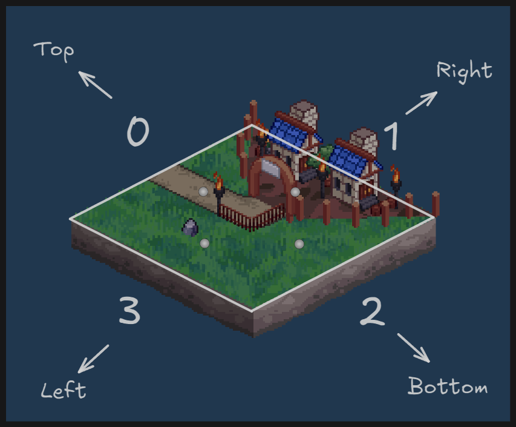

# Scoring System

## Overview

The scoring system in Mage Duel is based on connecting tiles through their edges and forming closed structures of cities and roads. When a structure is completed (closed), a **contest** occurs - a competition between players for ownership of that structure.

## Core Concepts

### Tile Connections

- Tiles connect through their edges
- Each edge type can only connect to the same type:
  - City to city
  - Road to road  
  - Field to field
- **Exception**: Mountains on the board edge can border any edge type, but only if the tile is properly connected to other tiles with matching edges

### Edge Numbering System

The 8×8 game board contains 256 possible edge positions (8×8×4).

For a tile at position (col, row):
- **Top edge**: 0
- **Right edge**: 1  
- **Bottom edge**: 2
- **Left edge**: 3



### Edge Position Calculation

```rust
fn convert_board_position_to_node_position(tile_position: u8, edge: u8) -> u8 {
    tile_position * 4 + edge
}
```

## Contests

### What is a Contest

A **contest** occurs when a structure (city or road) becomes closed - no new edges can be attached to it (open_edges = 0).

### Contest Rules

1. **Winner Takes All**: The player with more points in the structure wins all points from that structure
2. **Loser Loses All**: The losing player loses all their points from that structure
3. **Draw**: If players have equal points, no one gets the points
4. **End Game**: At game end, all structures (open or closed) participate in contests

### Point Distribution

- **Cities**: 2 points per tile for the player who placed it
- **Roads**: 1 point per tile for the player who placed it
- **Board Edges**: Additional points when connecting to board edges with matching types

## Data Structures

### UnionFind Model (Storage)

The main storage model for the union-find structure:

```rust
#[derive(Drop, Serde, Introspect, Debug)]
#[dojo::model]
pub struct UnionFind {
    #[key]
    pub board_id: felt252,
    pub nodes_parents: Span<u8>,
    pub nodes_ranks: Span<u8>,
    pub nodes_blue_points: Span<u16>,
    pub nodes_red_points: Span<u16>,
    pub nodes_open_edges: Span<u8>,
    pub nodes_contested: Span<bool>,
    pub nodes_types: Span<u8>, // 0: City, 1: Road, 2: None
    pub potential_city_contests: Array<u8>,
    pub potential_road_contests: Array<u8>,
}
```

### UnionNode (Runtime)

For runtime operations, the storage model is converted to `NullableVec<UnionNode>`:

```rust
/// Represents a node involved in a potential contest.
#[derive(Drop, Destruct, Serde, Copy, Introspect, PartialEq, Debug)]
pub struct UnionNode {
    pub parent: u8,           // Parent node reference for union-find
    pub rank: u8,             // Rank in the disjoint set
    pub blue_points: u16,     // Points earned by blue player
    pub red_points: u16,      // Points earned by red player
    pub open_edges: u8,       // Number of open edges
    pub contested: bool,      // Whether this structure was contested
    pub node_type: u8,        // 0: City, 1: Road, 2: None
}
```

## Union-Find Algorithm

The union-find data structure efficiently manages connected components and handles merging of structures.

### Core Functions

#### Find Operation

```rust
pub fn find(
    ref world: WorldStorage, 
    ref nodes: NullableVec<UnionNode>, 
    position: u8
) -> u8 {
    if let Option::Some(node) = nodes.get(position.into()) {
        let mut current = node;
        if current.parent != position {
            // Path compression optimization
            current.parent = find(ref world, ref nodes, current.parent);
        }
        current.parent
    } else {
        panic!("[UnionFind error] Index out of bounds.");
    }
}
```

#### Union Operation

```rust
pub fn union(
    ref world: WorldStorage, 
    ref nodes: NullableVec<UnionNode>, 
    position1: u8, 
    position2: u8, 
    in_tile: bool,
) -> UnionNode {
    let root1_pos = find(ref world, ref nodes, position1);
    let root2_pos = find(ref world, ref nodes, position2);
    
    if root1_pos == root2_pos {
        // Same component - reduce open edges if connecting between tiles
        if !in_tile {
            let mut root = nodes.at(root1_pos.into());
            root.open_edges -= 2;
            nodes.set(root1_pos.into(), root);
        }
        return nodes.at(root1_pos.into());
    }
    
    // Union by rank with point merging
    // ... (implementation details in the provided code)
}
```

#### Connected Check

```rust
pub fn connected(
    ref world: WorldStorage, 
    ref nodes: NullableVec<UnionNode>, 
    position1: u8, 
    position2: u8
) -> bool {
    find(ref world, ref nodes, position1) == find(ref world, ref nodes, position2)
}
```

## City Scoring Algorithm

### Workflow

1. **Connect city edges within tile** - Link city edges on the same tile
2. **Connect to adjacent tiles** - Link to neighboring city structures
3. **Check for completion** - Detect when `open_edges = 0`
4. **Handle contest** - Resolve ownership when structure closes

### Key Functions

#### Connect City Edges in Tile

```rust
pub fn connect_city_edges_in_tile(
    ref world: WorldStorage, 
    ref city_nodes: NullableVec<UnionNode>, 
    tile_position: u8, 
    tile: u8, 
    rotation: u8, 
    side: u8,
) {
    let extended_tile = create_extended_tile(tile.into(), rotation);
    let mut cities: Array<u8> = ArrayTrait::new();

    // Create nodes for each city edge
    for i in 0..4_u8 {
        if *extended_tile.edges.at(i.into()) == (TEdge::C).into() {
            let position = convert_board_position_to_node_position(tile_position, i);
            let city_node = UnionNode {
                parent: position,
                rank: 1,
                blue_points: if side == (PlayerSide::Blue).into() { 2 } else { 0 },
                red_points: if side == (PlayerSide::Red).into() { 2 } else { 0 },
                open_edges: 1,
                contested: false,
                node_type: 0, // City
            };
            city_nodes.set(position.into(), city_node);
            cities.append(position);
        }
    }

    // Union city edges within the same tile
    if cities.len() > 1 {
        for i in 1..cities.len() {
            union(ref world, ref city_nodes, *cities.at(0), *cities.at(i), true);
        }
    }
}
```

#### Connect Adjacent City Edges

This function handles connections to neighboring tiles and manages contest resolution:

```rust
pub fn connect_adjacent_city_edges(
    ref world: WorldStorage,
    board_id: felt252,
    state: Span<(u8, u8, u8)>,
    ref initial_edge_state: Span<u8>,
    ref city_nodes: NullableVec<UnionNode>,
    tile_position: u8,
    tile: u8,
    rotation: u8,
    side: u8,
    player_address: ContractAddress,
    ref visited: Felt252Dict<bool>,
    ref potential_cities_contests: Array<u8>,
) -> Option<(PlayerSide, u16)> {
    // Implementation connects to adjacent tiles in 4 directions
    // Checks board boundaries and edge connections
    // Triggers contests when structures are completed
    // Returns contest results if any
}
```

#### Contest Handling

```rust
pub fn handle_contest(
    ref world: WorldStorage, 
    ref nodes: NullableVec<UnionNode>, 
    mut city_root_pos: u8, 
    board_id: felt252,
) -> Option<(PlayerSide, u16)> {
    let mut city_root = nodes.at(city_root_pos.into());
    city_root.contested = true;
    
    if city_root.blue_points > city_root.red_points {
        // Blue wins - gets all points
        let points_delta = city_root.red_points;
        city_root.blue_points += city_root.red_points;
        city_root.red_points = 0;
        
        world.emit_event(@CityContestWon { /* ... */ });
        return Option::Some((PlayerSide::Blue, points_delta));
        
    } else if city_root.blue_points < city_root.red_points {
        // Red wins - gets all points
        let points_delta = city_root.blue_points;
        city_root.red_points += city_root.blue_points;
        city_root.blue_points = 0;
        
        world.emit_event(@CityContestWon { /* ... */ });
        return Option::Some((PlayerSide::Red, points_delta));
        
    } else {
        // Draw - no winner
        world.emit_event(@CityContestDraw { /* ... */ });
        return Option::None;
    }
}
```

## Road Scoring Algorithm

The road scoring system works similarly to cities but with different point values and connection rules.

### Key Differences from Cities

- **Points**: 1 point per tile (vs 2 for cities)
- **Special case**: `CRCR` tiles don't auto-connect their road edges
- **Multiple contests**: Can have multiple road contests per move

### Main Functions

#### Connect Road Edges in Tile

```rust
pub fn connect_road_edges_in_tile(
    ref world: WorldStorage, 
    ref road_nodes: NullableVec<UnionNode>, 
    tile_position: u8, 
    tile: u8, 
    rotation: u8, 
    side: u8,
) {
    // Similar to cities but with road-specific logic
    // Special handling for CRCR tiles
}
```

#### Connect Adjacent Road Edges

```rust
pub fn connect_adjacent_road_edges(
    // Similar parameters to city version
) -> Span<Option<(PlayerSide, u16)>> {
    // Returns array of contest results since multiple roads can complete
    // Handles special cases for different tile types
}
```

## Integration in make_move

The scoring system integrates into the main game loop through the `make_move` function:

### Scoring Flow

1. **Convert storage to runtime format**
   ```rust
   let mut city_nodes = VecTrait::<NullableVec, UnionNode>::new();
   let mut road_nodes = VecTrait::<NullableVec, UnionNode>::new();
   
   // Convert UnionFind storage model to NullableVec
   for i in 0..union_find.nodes_parents.len() {
       // Populate city_nodes and road_nodes based on node_type
   }
   ```

2. **Calculate immediate points**
   ```rust
   let (tile_city_points, tile_road_points) = calcucate_tile_points(tile.into());
   let (edges_city_points, edges_road_points) = calculate_adjacent_edge_points(
       ref board.initial_edge_state, col, row, tile.into(), rotation,
   );
   ```

3. **Process city connections**
   ```rust
   connect_city_edges_in_tile(/* ... */);
   let city_contest_result = connect_adjacent_city_edges(/* ... */);
   ```

4. **Process road connections**
   ```rust
   connect_road_edges_in_tile(/* ... */);
   let road_contest_results = connect_adjacent_road_edges(/* ... */);
   ```

5. **Apply contest results to scores**
   ```rust
   if city_contest_result.is_some() {
       let (winner, points_delta) = city_contest_result.unwrap();
       // Update board scores based on winner
   }
   
   for result in road_contest_results {
       // Apply each road contest result
   }
   ```

6. **Convert back to storage format**
   ```rust
   // Convert NullableVec back to UnionFind storage model
   union_find.nodes_parents = new_nodes_parents.span();
   union_find.nodes_ranks = new_nodes_ranks.span();
   // ... other fields
   ```

### End Game Scoring

When the game ends (no tiles left and no jokers), all remaining open structures participate in contests using the **potential contests** system.

#### Potential Contests Arrays

The `UnionFind` model maintains two special arrays:
- `potential_city_contests: Array<u8>` - Root nodes of open city structures
- `potential_road_contests: Array<u8>` - Root nodes of open road structures

These arrays contain **parent nodes** (roots) of each connected component that hasn't been contested yet. During gameplay, when structures are created but not yet closed, their root nodes are tracked in these arrays.

#### End Game Contest Resolution

```rust
fn _finish_game(
    ref board: Board, 
    potential_city_contests: Span<u8>, 
    potential_road_contests: Span<u8>,
    ref city_nodes: NullableVec<UnionNode>,
    ref road_nodes: NullableVec<UnionNode>,
) {
    // Close all remaining open city structures
    let city_results = close_all_cities(
        ref world, 
        potential_city_contests, 
        ref city_nodes, 
        board_id
    );
    
    // Close all remaining open road structures  
    let road_results = close_all_roads(
        ref world, 
        potential_road_contests, 
        ref road_nodes, 
        board_id
    );
    
    // Apply all contest results to final scores
    for result in city_results {
        // Update scores based on city contest outcomes
    }
    
    for result in road_results {
        // Update scores based on road contest outcomes  
    }
}
```

#### Close All Structures Functions

```rust
pub fn close_all_cities(
    ref world: WorldStorage, 
    potential_city_contests: Span<u8>, 
    ref nodes: NullableVec<UnionNode>, 
    board_id: felt252,
) -> Span<Option<(PlayerSide, u16)>> {
    let mut contest_results: Array<Option<(PlayerSide, u16)>> = ArrayTrait::new();
    
    for i in 0..potential_city_contests.len() {
        let root_pos = find(ref world, ref nodes, *potential_city_contests.at(i));
        let mut root = nodes.at(root_pos.into());
        
        // Only contest if not already contested
        if !root.contested {
            let contest_result = handle_contest(ref world, ref nodes, root_pos, board_id);
            contest_results.append(contest_result);
        }
    }
    
    return contest_results.span();
}

pub fn close_all_roads(
    ref world: WorldStorage, 
    potential_road_contests: Span<u8>, 
    ref nodes: NullableVec<UnionNode>, 
    board_id: felt252,
) -> Span<Option<(PlayerSide, u16)>> {
    // Similar implementation for road structures
}
```

The key insight is that `potential_city_contests` and `potential_road_contests` contain the **root nodes** of each disjoint set (connected component) in the union-find structure. At game end, we iterate through these roots and force contests on any structures that haven't been contested yet.

## Performance Considerations

### Union-Find Optimizations

- **Path Compression**: `find` operation compresses paths for O(α(n)) amortized time
- **Union by Rank**: Keeps trees shallow for efficient operations
- **Batch Processing**: Multiple contests resolved in single transaction

### Memory Management

- **NullableVec**: Efficient sparse array implementation using Felt252Dict
- **Conversion Strategy**: Only convert to runtime format during moves
- **Span Usage**: Immutable references for read-only operations

## Events and Monitoring

The system emits events for tracking contest outcomes:

```rust
#[derive(Drop, Serde)]
#[dojo::event]
pub struct CityContestWon {
    pub board_id: felt252,
    pub root: u8,
    pub winner: PlayerSide,
    pub red_points: u16,
    pub blue_points: u16,
}

#[derive(Drop, Serde)]
#[dojo::event]
pub struct CityContestDraw {
    pub board_id: felt252,
    pub root: u8,
    pub red_points: u16,
    pub blue_points: u16,
}
```

Similar events exist for road contests, enabling comprehensive game state tracking and analytics.

## Performance Considerations

### Union-Find Optimizations

- **Path Compression**: `find` operation compresses paths for O(α(n)) amortized time
- **Union by Rank**: Keeps trees shallow for efficient operations
- **Batch Processing**: Multiple contests resolved in single transaction

### Memory Management

- **NullableVec**: Efficient sparse array implementation using Felt252Dict
- **Conversion Strategy**: Only convert to runtime format during moves
- **Span Usage**: Immutable references for read-only operations

## Events and Monitoring

The system emits events for tracking contest outcomes:

```rust
#[derive(Drop, Serde)]
#[dojo::event]
pub struct CityContestWon {
    pub board_id: felt252,
    pub root: u8,
    pub winner: PlayerSide,
    pub red_points: u16,
    pub blue_points: u16,
}

#[derive(Drop, Serde)]
#[dojo::event]
pub struct CityContestDraw {
    pub board_id: felt252,
    pub root: u8,
    pub red_points: u16,
    pub blue_points: u16,
}
```

Similar events exist for road contests, enabling comprehensive game state tracking and analytics.

## Summary

The Mage Duel scoring system is a sophisticated implementation that combines several key components:

### Core Architecture
- **Union-Find Data Structure**: Efficiently manages connected components of cities and roads
- **Dual Storage System**: Storage model (`UnionFind`) for persistence, runtime model (`NullableVec<UnionNode>`) for operations  
- **Edge-Based Representation**: 256 possible edge positions (8×8×4) with precise numbering system

### Scoring Mechanics
- **Immediate Points**: Players earn points when placing tiles (2 for cities, 1 for roads)
- **Contest System**: When structures close (`open_edges = 0`), winner takes all points from that structure
- **Board Edge Bonuses**: Additional points when connecting to matching board edge types
- **End Game Resolution**: All open structures participate in forced contests

### Key Features
- **Real-time Contest Detection**: Automatic triggering when structures complete
- **Efficient Path Compression**: Union-find operations run in near-constant time
- **Comprehensive Event System**: Full audit trail of all contest outcomes
- **Scalable Architecture**: Handles complex board states with multiple simultaneous contests

### Performance Benefits
- **O(α(n)) Operations**: Near-constant time for union-find operations due to path compression
- **Batch Processing**: Multiple contests resolved efficiently in single transaction
- **Memory Optimization**: Sparse array implementation using hash tables
- **Minimal State Conversion**: Only convert storage format during active gameplay

This system ensures fair, deterministic, and efficient scoring while maintaining the strategic depth that makes Mage Duel engaging. The union-find approach elegantly handles the complex graph connectivity problems inherent in tile-based games, while the contest system creates meaningful strategic decisions around timing and positioning.