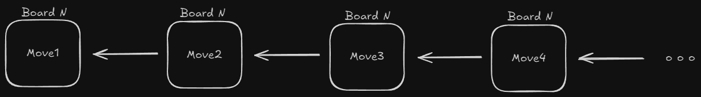
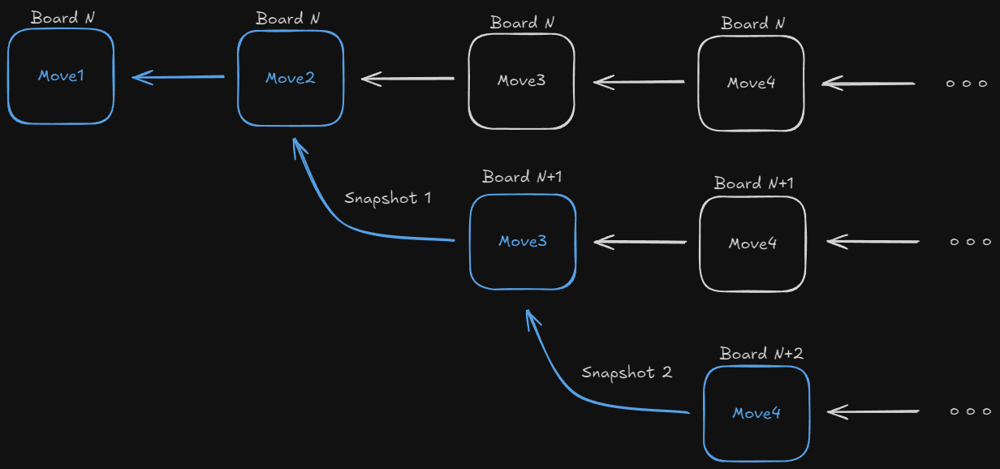

# Board Snapshot and State Recovery System

## Overview

The snapshot system in Mage Duel enables **time travel** functionality - the ability to revert the game board to any previous state. This powerful feature allows players to explore alternative game paths, analyze past decisions, and create branching game scenarios from any point in the match history.

## Core Concepts

### Move Chain Architecture

Every board maintains a **linked list of moves** that forms the complete game history:

```cairo
pub struct Move {
    pub id: felt252,
    pub prev_move_id: Option<felt252>,  // Points to previous move
    pub player_side: PlayerSide,
    pub tile: Option<u8>,
    pub rotation: u8,
    pub col: u8,
    pub row: u8,
    pub is_joker: bool,
    pub first_board_id: felt252,
    pub timestamp: u64,
}

pub struct Board {
    pub last_move_id: Option<felt252>,  // Head of the move chain
    // ... other fields
}
```

This creates a **backward-traversable chain** where each move points to its predecessor, enabling reconstruction of any previous board state.



### Branching Through Snapshots

When a snapshot is created from a historical state, it forms a **new branch** in the game tree:



## Snapshot Creation Process

### High-Level Workflow

The snapshot system works through a **reverse reconstruction** process:

1. **Start from current board** with full state and move history
2. **Walk backward** through the move chain to the target point
3. **Reverse each move's effects** on board state and deck
4. **Reconstruct scoring** from the reverted state
5. **Create new board** with recovered state


### Implementation Deep Dive

```cairo
pub fn create_board_from_snapshot(
    ref world: WorldStorage,
    old_board_id: felt252,
    player1: ContractAddress,
    move_number: u8,      // Target move to revert to
    board_id_generator: StorageBase<Mutable<felt252>>,
) -> felt252 {
    let board_id = board_id_generator.read();
    let old_board: Board = world.read_model(old_board_id);
    
    // Calculate how many moves to reverse
    let number_of_reverted_moves = old_board.moves_done - move_number.into();
    
    // Begin the reverse walk process...
}
```

## State Reversal Algorithm

### Move Reversal Process

The system walks backward through the move chain, undoing each move's effects:

```cairo
let mut last_move_id = old_board.last_move_id;
let mut top_tile = old_board.top_tile;
let mut available_tiles_in_deck = old_board.available_tiles_in_deck.clone();
let mut deleted_tiles_positions: Felt252Dict<bool> = Default::default();

for _ in 0..number_of_reverted_moves {
    let move_id = last_move_id.unwrap();
    let move: Move = world.read_model(move_id);
    
    // Move to previous move in chain
    last_move_id = move.prev_move_id;
    
    // Skip move reversal (no board changes)
    if !move.is_joker && move.tile.is_none() {
        continue;
    }
    
    // Mark tile position for removal
    let index = (move.col * 8 + move.row).into();
    deleted_tiles_positions.insert(index, true);
    
    // Reverse move effects...
}
```

### Tile and Deck Restoration

Each move type requires different reversal logic:

#### Regular Tile Moves
```cairo
// Restore deck state
if top_tile.is_some() {
    available_tiles_in_deck.append(top_tile.unwrap());
}
top_tile = move.tile;  // Tile goes back to top of deck
```

#### Joker Moves
```cairo
// Restore joker count
if move.is_joker {
    if move.player_side == player1_side {
        joker_number1 += 1;  // Give joker back to player
    } else {
        joker_number2 += 1;
    }
}
```

### Board State Reconstruction

After identifying all moves to reverse, the system rebuilds the board state:

```cairo
let mut updated_state: Array<(u8, u8, u8)> = ArrayTrait::new();

for i in 0..old_board.state.len() {
    if !deleted_tiles_positions.get(i.into()) {
        // Keep tile if not deleted
        updated_state.append(*old_board.state.at(i.into()));
    } else {
        // Replace with empty tile if deleted
        updated_state.append((Tile::Empty.into(), 0, 0));
    }
}
```

## Scoring Reconstruction

### The Challenge

Simply reverting the board state isn't enough - we need to **recalculate all scores and union-find structures** because:

- Scores depend on complex tile interactions
- Union-find tracks connected structures
- Contest outcomes may have changed
- Edge connections need rebuilding

### Fresh Scoring Calculation

The system rebuilds scoring from scratch using `build_score_from_state`:

```cairo
// Initialize empty scoring structures
let mut road_nodes: NullableVec<UnionNode> = VecTrait::new();
let mut city_nodes: NullableVec<UnionNode> = VecTrait::new();
let mut potential_city_contests: Array<u8> = array![];
let mut potential_road_contests: Array<u8> = array![];

// Rebuild everything from the reverted state
build_score_from_state(
    ref world, 
    ref board, 
    ref road_nodes, 
    ref potential_road_contests,
    ref city_nodes,
    ref potential_city_contests,
);
```

### Two-Phase Scoring Rebuild

#### Phase 1: Tile Processing and Initial Connections

```cairo
for i in 0..64_u8 {
    let (tile, rotation, player_side) = *board.state.at(i.into());
    
    // Calculate and award immediate points
    let (city_points, road_points) = calculate_tile_points(tile, rotation, position);
    award_points_to_player(player_side, city_points, road_points);
    
    // Create union-find nodes for this tile
    if tile != Tile::Empty.into() {
        connect_road_edges_in_tile(ref road_nodes, i, tile, rotation, player_side);
        connect_city_edges_in_tile(ref city_nodes, i, tile, rotation, player_side);
    }
}
```

#### Phase 2: Cross-Tile Connections via BFS

```cairo
let mut visited: Felt252Dict<bool> = Default::default();

for i in 0..64_u8 {
    if !visited.get(i.into()) {
        bfs(ref world, ref visited, ref board, /* scoring structures */, i);
    }
}
```

### Breadth-First Search for Connections

The BFS algorithm ensures all tile interconnections are properly established:

```cairo
fn bfs(/* ... */, start_index: u8) {
    let mut queue: Array<u8> = ArrayTrait::new();
    queue.append(start_index);
    
    while queue.len() > 0 {
        let current_index = queue.pop_front().unwrap();
        if visited.get(current_index.into()) {
            continue;
        }
        visited.insert(current_index.into(), true);
        
        // Process connections for current tile
        process_tile_connections(current_index);
        
        // Add unvisited neighbors to queue
        add_neighbors_to_queue(current_index, ref queue);
    }
}
```

The BFS ensures that:
- Every tile is processed exactly once
- All connected structures are properly linked
- Contest detection works correctly
- Scoring is consistent and complete

## Integration with Move System

### Snapshot Triggers

Snapshots can be created through various mechanisms:

1. **Player Request**: Manual snapshot creation at any point
2. **Strategic Analysis**: AI or client-side analysis tools
3. **Game Variants**: Tournament formats with branching rules
4. **Debugging**: Development and testing scenarios

### Board ID Management

Each snapshot creates a completely new board with its own ID:

```cairo
let board_id = board_id_generator.read();
board_id_generator.write(board_id + 1);  // Increment for next board
```

This ensures:
- **Isolation**: Snapshots don't interfere with original games
- **Traceability**: Each board has unique identity
- **Concurrency**: Multiple snapshots can exist simultaneously

### Event System Integration

The snapshot system integrates with the event system for monitoring:

```cairo
world.emit_event(
    @BoardCreatedFromSnapshot {
        board_id: new_board_id,
        old_board_id,
        move_number,
        // ... complete board state
    }
);
```

## Performance Considerations

### Memory Efficiency

- **Lazy Evaluation**: Only calculate what's needed
- **Sparse Storage**: Empty tiles take minimal space
- **Shared History**: Original move chain remains intact

### Computational Complexity

- **Move Reversal**: O(k) where k = number of moves to reverse
- **State Rebuild**: O(n) where n = number of tiles on board  
- **BFS Scoring**: O(n + m) where m = number of connections
- **Overall**: Linear in board size and move count

### Storage Optimization

The system minimizes storage overhead by:
- Reusing original board's `initial_edge_state`
- Only storing differences from base state
- Maintaining compact tile representations

## Use Cases and Applications

### Strategic Analysis
- **"What if" scenarios**: Explore alternative move sequences
- **Mistake correction**: Return to a point before a poor decision
- **Learning tool**: Compare different strategies from the same position

### Tournament Features
- **Save states**: Preserve important game positions
- **Replay analysis**: Study games from any point
- **Coaching tools**: Demonstrate concepts from specific positions

### Development and Testing
- **Bug reproduction**: Recreate specific game states
- **Feature testing**: Test new features on historical states
- **Performance benchmarking**: Measure system performance on real game data

## Error Handling and Edge Cases

### Validation Checks

```cairo
if last_move_id.is_none() {
    world.emit_event(@BoardCreateFromSnapshotFailed {
        player: player1, 
        old_board_id, 
        move_number,
    });
    break;
}
```

### Edge Cases Handled

1. **Invalid move numbers**: Requesting snapshot beyond game start
2. **Corrupted move chains**: Missing moves in the chain
3. **Resource limits**: Too many moves to reverse efficiently
4. **Concurrent access**: Multiple snapshot requests on same board

## Summary

The snapshot system represents a sophisticated **time travel mechanism** that enables:

### Technical Excellence
- **Complete State Recovery**: Perfect reconstruction of any historical board state
- **Efficient Algorithms**: Linear time complexity for most operations
- **Robust Error Handling**: Graceful degradation on edge cases
- **Event Integration**: Full audit trail of snapshot operations

### Strategic Value
- **Enhanced Gameplay**: Players can explore alternative strategies
- **Learning Platform**: Educational tool for game analysis
- **Tournament Support**: Advanced competitive features
- **Development Aid**: Powerful debugging and testing capabilities

### Implementation Highlights
- **Backward Move Chain Traversal**: Elegant linked-list based history
- **Two-Phase Scoring Rebuild**: Comprehensive score recalculation
- **BFS Connection Discovery**: Efficient structure reconnection
- **Immutable History**: Original games remain untouched

This system transforms Mage Duel from a linear game experience into a **branching universe of possibilities**, where every decision point can spawn new timelines for exploration and analysis.