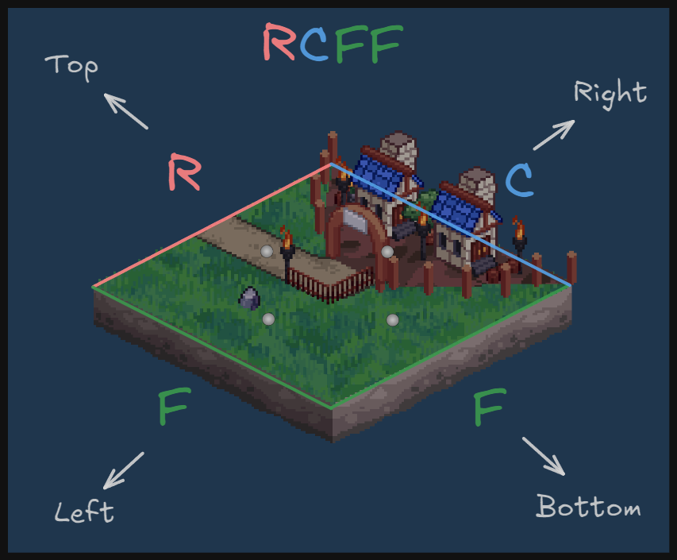
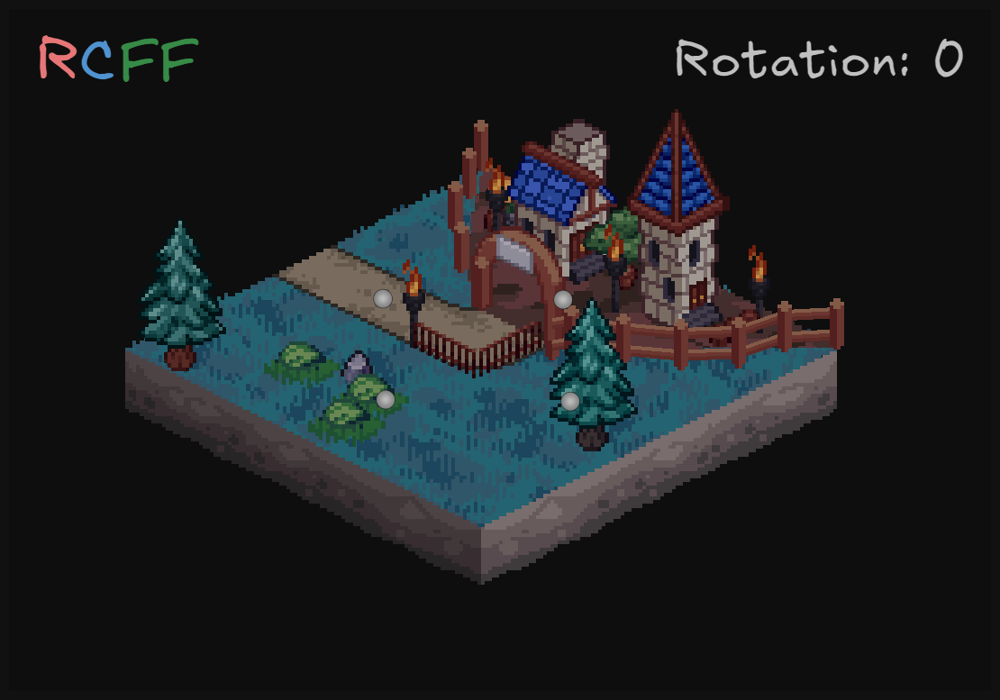
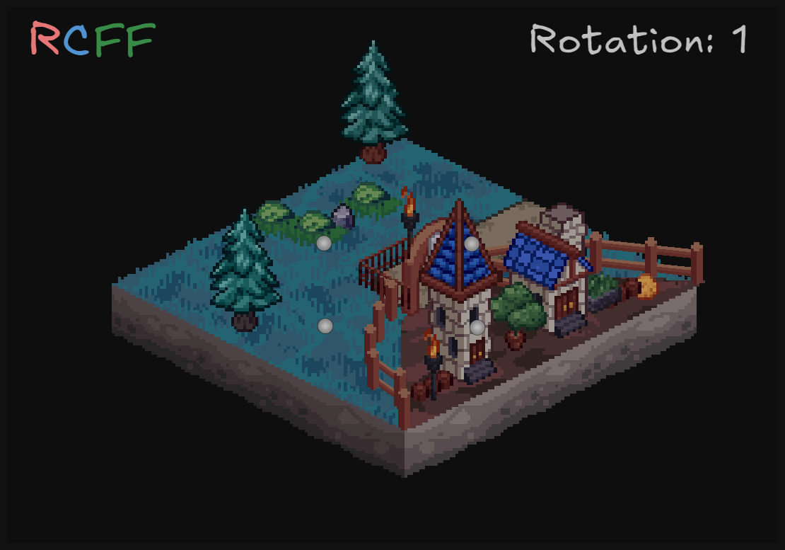
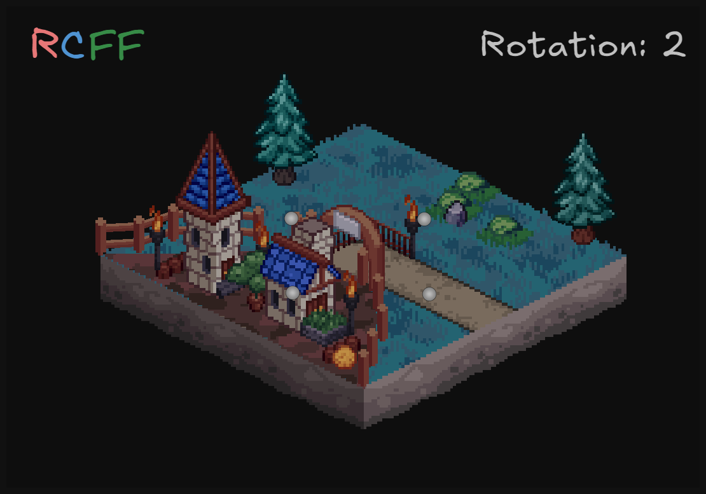
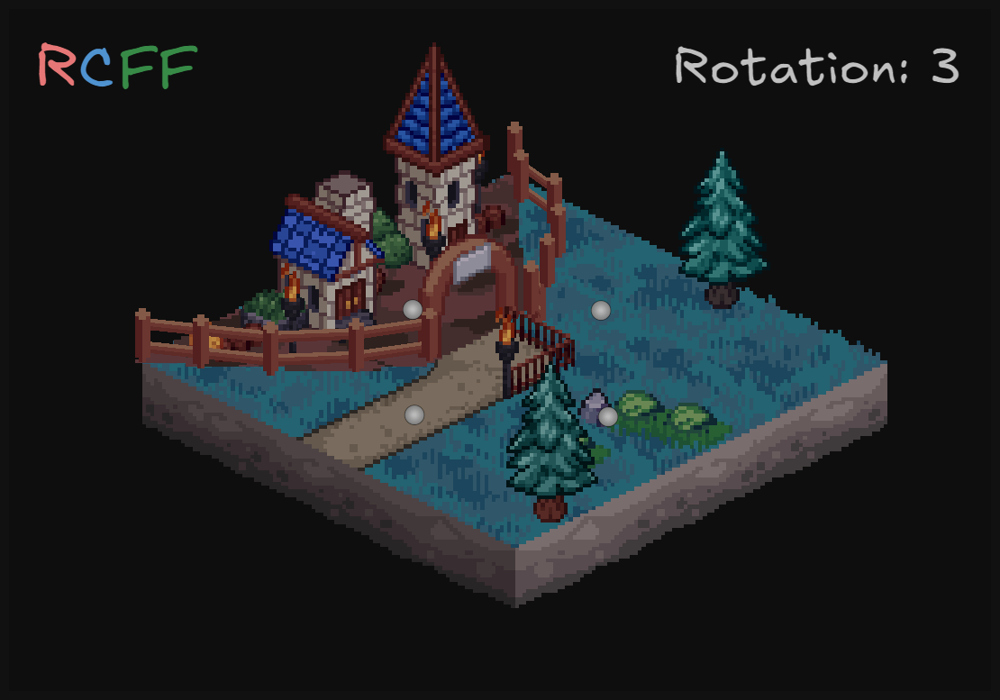
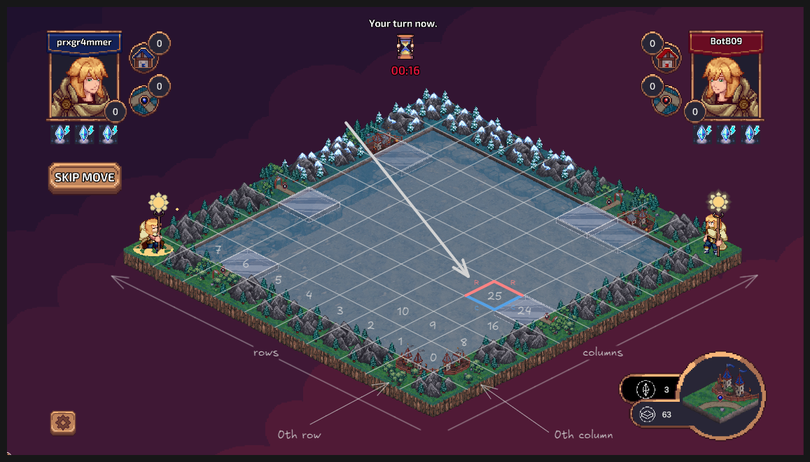

# Tile Structure, Orientation and Placing

This document explains how tiles work in Mage Duel - their structure, encoding, orientation, and how they appear on the board.

## Overview

In Mage Duel, tiles are the fundamental building blocks of gameplay. Each tile consists of 4 edges, and understanding how tiles are structured, encoded, and rotated is essential for game mechanics, placement validation, and scoring.

---

## Edge Types

Each edge of a tile can be one of four types:

```cairo
#[derive(Serde, Drop, IntrospectPacked, PartialEq, Debug, Destruct, Copy)]
pub enum TEdge {
    C,  // City - urban structures
    R,  // Road - pathways and connections  
    M,  // Mountain - also used for empty tiles
    F,  // Field - agricultural areas
}
```

### Edge Characteristics

- **City (C)**: High-value features, only connect to other cities. Cost 2 points per edge.
- **Road (R)**: Features, connect to form road networks. Cost 1 point per edge.
- **Field (F)**: Just field, that not cost any points
- **Mountain (M)**: Neutral features, also represents empty/unoccupied areas

---

## Tile Encoding System

### 4-Character String Encoding

Each tile type is encoded as a 4-character string where each position represents a specific edge:

```
Position 0: Top edge
Position 1: Right edge  
Position 2: Bottom edge
Position 3: Left edge
```

**Visual Representation:**

There is visualisation of tile RCFF:


### Example Tile Encodings

```cairo
Tile::CCCC  // All city edges
Tile::FFFF  // All field edges  
Tile::CCRR  // Cities on top/right, roads on bottom/left
Tile::CFCF  // Alternating city/field pattern
Tile::Empty // Mountain edges (empty tile)
```

---

## Complete Tile Types

```cairo
#[derive(Serde, Copy, Drop, IntrospectPacked, PartialEq, Debug)]
pub enum Tile {
    CCCC,  // All cities
    FFFF,  // All fields
    RRRR,  // All roads
    CCCF,  // Three cities, one field
    CCCR,  // Three cities, one road
    CFFF,  // One city, three fields
    FFFR,  // Three fields, one road
    CRRR,  // One city, three roads
    FRRR,  // One field, three roads
    CCFF,  // Two cities, two fields
    CFCF,  // Alternating city/field
    CCRR,  // Two cities, two roads
    CRCR,  // Alternating city/road
    FFRR,  // Two fields, two roads
    FRFR,  // Alternating field/road
    CCFR,  // Two cities, one field, one road
    CCRF,  // Two cities, one road, one field
    CFCR,  // City-field-city-road pattern
    CFFR,  // One city, two fields, one road
    CFRF,  // City-field-road-field pattern
    CRFF,  // One city, one road, two fields
    CRRF,  // One city, two roads, one field
    CRFR,  // City-road-field-road pattern
    CFRR,  // One city, one field, two roads
    Empty, // Empty tile (all mountains)
}
```

---

## Storage Conversion

Tiles are converted to `u8` values for efficient storage:

```cairo
impl TileToU8 of Into<Tile, u8> {
    fn into(self: Tile) -> u8 {
        match self {
            Tile::CCCC => 0,
            Tile::FFFF => 1,
            Tile::RRRR => 2,
            Tile::CCCF => 3,
            Tile::CCCR => 4,
            Tile::CCRR => 5,
            // ... continues for all tile types
            Tile::Empty => 24,
        }
    }
}
```

### Storage Benefits
- **Compact**: Only 1 byte per tile instead of enum storage
- **Efficient**: Fast comparisons and array indexing
- **Network Friendly**: Minimal bandwidth for state synchronization

---

## Tile Rotation System

### Rotation Values
Rotations are encoded as `u8` values from 0 to 3:

- **0**: No rotation (0°)
- **1**: 90° clockwise rotation
- **2**: 180° rotation  
- **3**: 270° clockwise rotation (90° counter-clockwise)

### Rotation Mechanics

```cairo
pub fn create_extended_tile(tile: Tile, rotation: u8) -> ExtendedTile {
    let mut edges = [/* tile's base edges */].span();
    let rotation = (rotation % 4);
    
    // Apply rotation by shifting edge positions
    for _ in 0..rotation {
        edges = [*edges[3], *edges[0], *edges[1], *edges[2]].span();
    };
    
    ExtendedTile { edges }
}
```

### How Rotation Works

**Base tile edges:** `[Top, Right, Bottom, Left]`

**After each 90° rotation:**
- New Top = Old Left
- New Right = Old Top  
- New Bottom = Old Right
- New Left = Old Bottom

---

## Visual Examples

### Example: RCFF Tile

**Base Configuration (rotation = 0):**

```
Encoding: RCFF
Edges: [R, C, F, F] (Top, Right, Bottom, Left)
```

**After 1 Rotation (rotation = 1, 90° clockwise):**

```
Encoding: Still RCFF, but rotated once
Edges: [F, R, C, F] (Top, Right, Bottom, Left)
```

**After 2 Rotations (rotation = 2, 180°):**

```
Encoding: Still RCFF, but rotated twice
Edges: [F, F, R, C] (Top, Right, Bottom, Left)
```
**After 3 Rotations (rotation = 3, 270°):**

```
Encoding: Still RCFF, but rotated three times
Edges: [C, F, F, R] (Top, Right, Bottom, Left)
```
---

## Tile Placement on Board

### Position Encoding
Board uses 8×8 grid with position calculated as:
```cairo
position = col * 8 + row
```


### Board State Storage
Each position stores tuple: `(tile_type, rotation, player_side)`

```cairo
// Example board state entry
state[25] = (5, 2, 1)  // Position 25(3rd column, 1st row in 0-indexed notation): Tile type 5 (CCRR), rotated 180°, placed by Red
```

### Visual Board Representation



---

## ExtendedTile Structure

### Purpose
ExtendedTile provides runtime edge information for a rotated tile:

```cairo
#[derive(Drop, Serde, Debug)]
struct ExtendedTile {
    pub edges: Span<TEdge>,  // [Top, Right, Bottom, Left] after rotation
}
```

### Usage Example

```cairo
// Get edges for CCRR tile rotated 90°
let extended_tile = create_extended_tile(Tile::CCRR, 1);
let edges = extended_tile.edges;

// edges now contains [R, C, C, R] representing:
// Top: Road, Right: City, Bottom: City, Left: Road
```

---

## Practical Applications

### Tile Placement Validation

```cairo
fn can_place_tile(tile: Tile, rotation: u8, col: u8, row: u8, board: @Board) -> bool {
    let extended_tile = create_extended_tile(tile, rotation);
    let edges = extended_tile.edges;
    
    // Check adjacent tiles and board edges for compatibility
    // Top edge must match bottom edge of tile above
    // Right edge must match left edge of tile to the right
    // etc.
}
```

### Scoring Calculations

```cairo
fn calculate_tile_score(tile: Tile, rotation: u8, position: u8) -> (u16, u16) {
    let extended_tile = create_extended_tile(tile, rotation);
    let edges = extended_tile.edges;
    
    let mut city_points = 0;
    let mut road_points = 0;
    
    // Count edge types for scoring
    for edge in edges {
        match *edge {
            TEdge::C => city_points += 2,
            TEdge::R => road_points += 1,
            _ => {},
        }
    }
    
    (city_points, road_points)
}
```

### Connection Detection

```cairo
fn tiles_can_connect(tile1: ExtendedTile, edge1: u8, tile2: ExtendedTile, edge2: u8) -> bool {
    let edge1_type = *tile1.edges.at(edge1.into());
    let edge2_type = *tile2.edges.at(edge2.into());
    
    match (edge1_type, edge2_type) {
        (TEdge::C, TEdge::C) => true,  // Cities connect
        (TEdge::R, TEdge::R) => true,  // Roads connect
        (TEdge::F, TEdge::F) => true,  // Fields connect
        (TEdge::M, _) => true,         // Mountains connect to anything
        (_, TEdge::M) => true,         // Anything connects to mountains
        _ => false,                    // Different types don't connect
    }
}
```

---

## Advanced Concepts

### Symmetric vs Asymmetric Tiles

**Symmetric Tiles** (look same after some rotations):
- `CCCC`: Identical in all rotations
- `CFCF`: Identical after 180° rotation
- `FRFR`: Identical after 180° rotation

**Asymmetric Tiles** (unique in each rotation):
- `CCCF`: Four distinct orientations
- `CCFR`: Four distinct orientations

### Tile Rarity and Strategy

**Common Patterns:**
- `FFFF`: Simple field tiles
- `CCFF`: Balanced city/field mix

**Rare Patterns:**
- `CCCC`: All-city high-value tiles
- `RRRR`: All-road network tiles

**Strategic Patterns:**
- `CFCR`: Complex connection opportunities
- `CRFR`: Alternating road/other patterns

---

## Summary

The tile system in Mage Duel is elegantly designed with:

1. **Simple Encoding**: 4-character edge descriptions
2. **Efficient Storage**: u8 conversion for compact representation
3. **Flexible Rotation**: 90° increments with automatic edge shifting
4. **Rich Variety**: 24 distinct tile types plus empty
5. **Strategic Depth**: Multiple orientations create placement opportunities
6. **Clear Validation**: Edge matching rules for legal placement
7. **Scoring Integration**: Edge types directly influence point calculation

Understanding tile structure is fundamental to mastering Mage Duel, as it affects placement decisions, scoring opportunities, and strategic planning throughout the game.