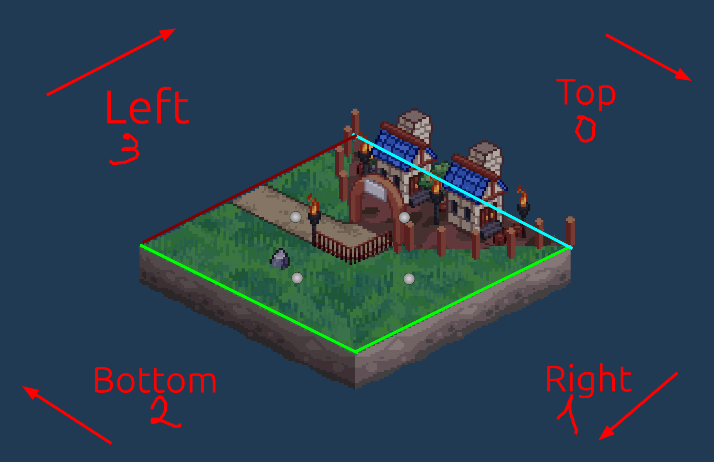
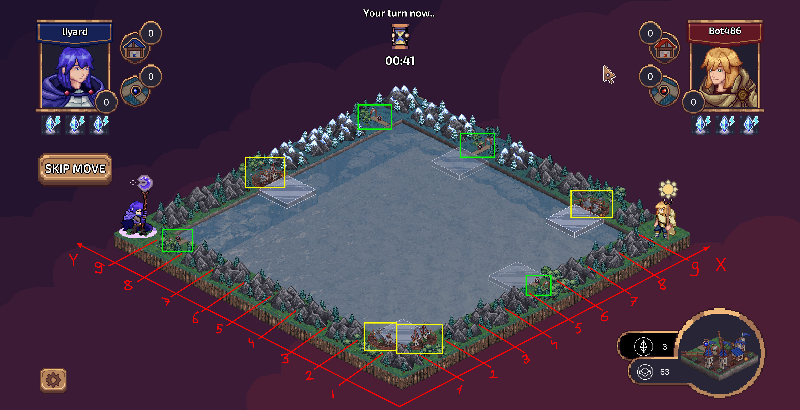

# Game Components

## Tile System

### Overview
The tile system is the core gameplay mechanic where players place tiles to create structures and earn points. Each tile consists of four sides, each with a specific type:
- Field (F)
- City (C)
- Road (R)

### Tile Placement Rules
- Tiles can only be placed adjacent to existing tiles
- All connecting edges must match in type
- Total possible tile combinations: 24

### Tile Types
The game includes the following tile combinations:

```csharp title="Assets/TerritoryWars/DataModels/GameConfiguration.cs"
public static string[] TileTypes =
{
    "CCCC", "FFFF", "RRRR", "CCCF", "CCCR", "CCRR", "CFFF", "FFFR", "CRRR", "FRRR",
    "CCFF", "CFCF", "CRCR", "FFRR", "FRFR", "CCFR", "CCRF", "CFCR", "CFFR", "CFRF",
    "CRFF", "CRRF", "CRFR", "CFRR"
};
```

### Tile Structure
Each tile type has a corresponding prefab located at:
`Assets/Prefabs/TilePrefabs/FullTilePrefab`

Visual representation:


#### Key Features
- **Orientation**: Top edge is positioned at top-right
- **Rotation**: Occurs clockwise
- **Object Manipulation**: Multiple methods available for position and rotation changes

### Tile Data Structure
The `TileData` class manages tile information:

```csharp title="Assets/TerritoryWars/Tile/TileData.cs"
public class TileData
{
    public string RotatedConfig; 
    public string Type;          // Format: "CCRF"
    public Vector2Int Position;  // Range: [0, 0] to [9, 9]
    public int Rotation;         // Range: 0 to 4
    public int PlayerSide;       // Session player side
    
    // other code
}
```

### Supporting Components

#### TileGenerator
- **Purpose**: Handles tile generation
- **Location**: `Assets/TerritoryWars/Tile/TileGenerator.cs`

#### TileRotator
- **Purpose**: Manages tile rotation
- **Location**: `Assets/TerritoryWars/Tile/TileRotator.cs`

#### TileParts
- **Purpose**: Manages tile graphical elements
- **Location**: `Assets/TerritoryWars/Tools/TileParts.cs`

## Board System

### Board Structure
- **Total Size**: 10x10
- **Active Area**: 8x8 (playable area)
- **Outline**: Pre-generated starting structures

Visual representation:


### Board Management
The `BoardManager` class handles tile storage and board state:

```csharp title="Assets/TerritoryWars/General/BoardManager.cs"
public class BoardManager : MonoBehaviour
{
    // other code

    private GameObject[,] tileObjects;
    private TileData[,] tileData;

    // other code
}
```

### Coordinate System
- **X-axis**: 
  - Origin: Bottom
  - Direction: Up-right
- **Y-axis**:
  - Origin: Bottom
  - Direction: Up-left