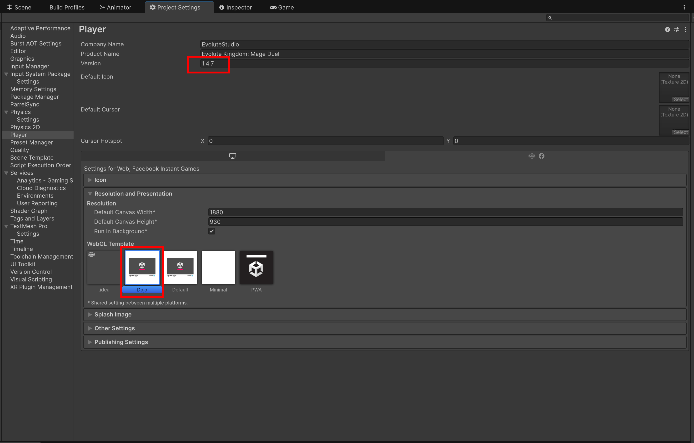

# Creating a Build

## Settings and Build

Open `Edit -> Project settings -> Player -> Web -> Resolution and Presentation` and check if the **Dojo** template is selected. Also pay attention to the version.

Open `File -> Build Profiles` and select the **Web** platform (if it's not there, install it through unity hub). Click the **Build** button.
You need to specify the exact build name `mageduel-webgl-x.y.z`, where x, y, z is the version.
