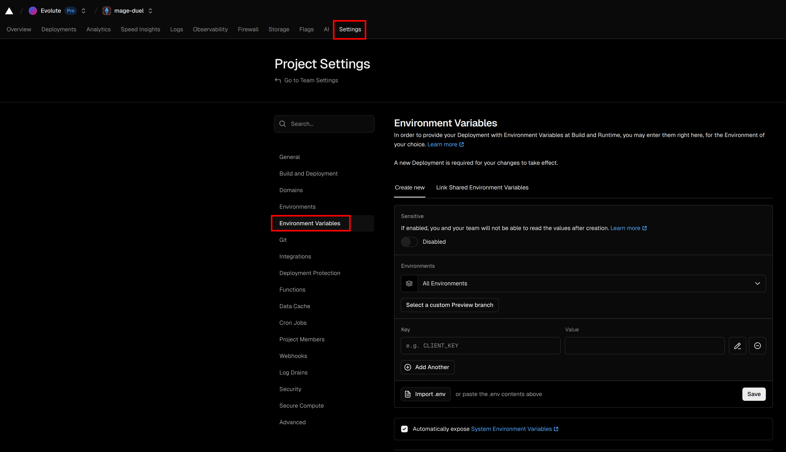

# Деплой

## Vercel
Створіть fork репозиторію [mage-duel-webgl](https://github.com/evolute-studio/mage-duel-webgl). І створіть проект у Vercel.
:::info
Обов'язково потрібно задати змінні середовища в vercel проекті. Просто імпортуйте значення з вашого `.env.local`.

:::

Далі після коміту, створиться автоматичний deployment
