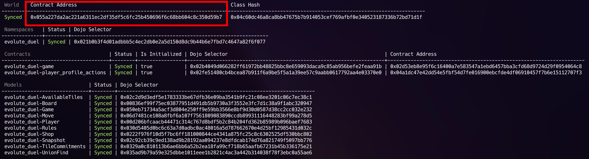
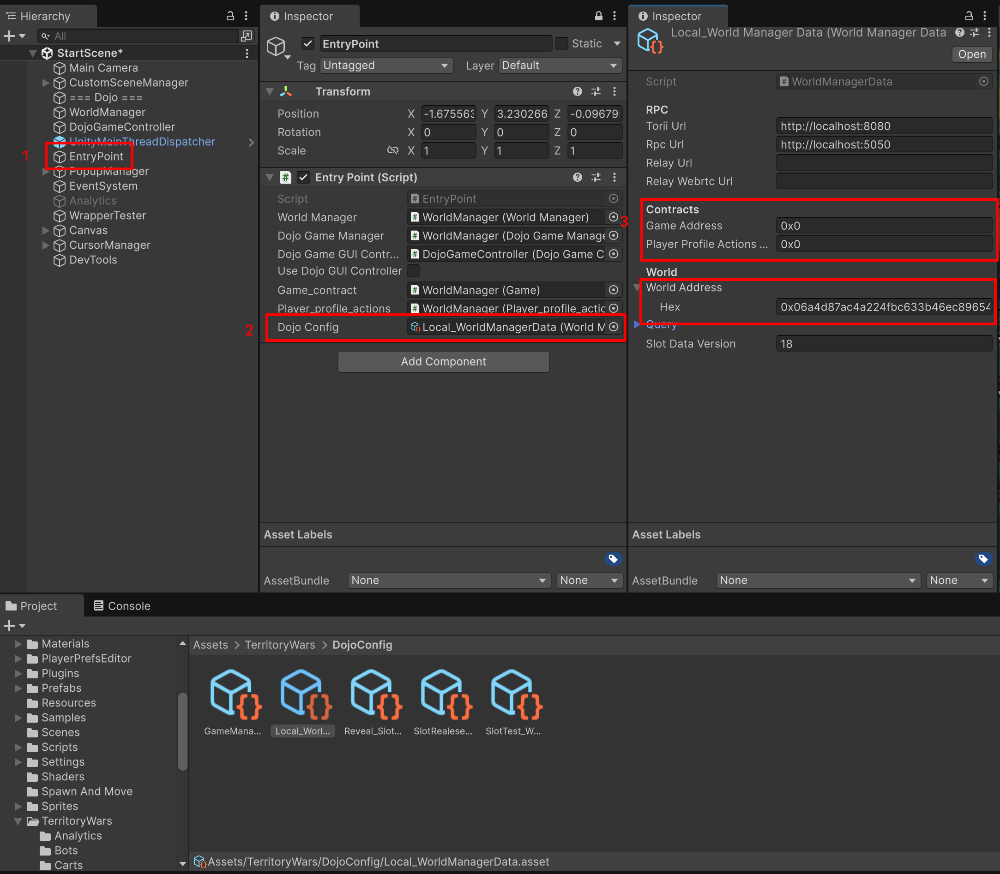

# Ініціалізація

## Запуск серверу

Для початку встановіть Dojo, це можна зробити за цією [інструкцією](https://dojoengine.org/installation#installing-dojo-with-dojoup)

Склонуйте репозиторій серверу і перейдіть в нього:

```bash
git clone https://github.com/evolute-studio/territory-wars-dojo
cd territory-wars-dojo
```

Запустіть katana:

```bash
katana --dev --dev.no-fee --http.cors_origins '*'
```

Далі треба зробити білд, зробити міграцю котрактів і моделей на локальну kanata і перевірити адреса світу і контрактів:

```bash
sozo build --unity
sozo migrate
sozo inspect
```

Після команди `sozo inspect` ви отримаєте такий вивід. Якщо в колонці `Status` стоїть значення `Synced` або `Updated` - вітаю, все пройшло коректно. Якщо ж `Created` - контрактів і моделей немає на Katana.



Виділений адрес світу треба вставити у конфігураційний файл torii `torii_config_dev.toml`.
Після цього можете запускати torii:

```bash
torii --config torii_config_dev.toml
```

Вітаю сервер створений, запущений і готовий до роботи!

## Конфігурація клієнта

Після відкриття unity проекту, потрібно знайти стартому сцену `Assets/Scenes/StartScene.unity`.
Треба знайти game object `EntryPoint` в іерархії, встановити `Dojo Config` який є scriptable object, в який треба внести данні вашого локального серверу: `World address`, `Game contract address`, `PLayer profile actions contract address` (Ці адреси ви може отримати через команду `sozo inspect`)

Приклади інших конфігурацій ви можете знайти тут: `Assets/TerritoryWars/DojoConfig/`


