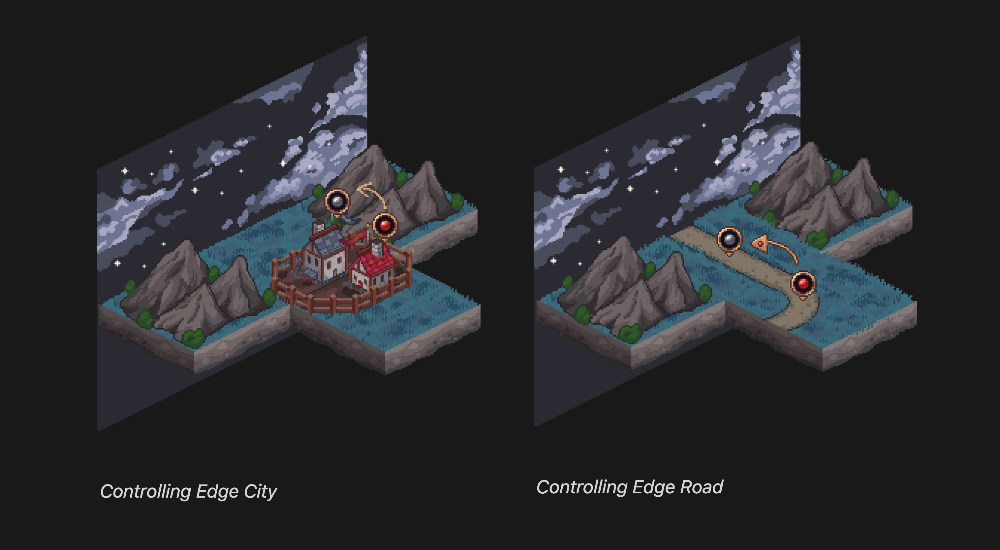

# Overview

This is the game. [Play it!](https://mageduel.evolute.network)

  

## What is Evolute Kingdom: Mage Duel?

Mage Duel is a tile-placement game where two mages compete to build cities, roads, and fields. Using Evolute magic, players shape the landscape by strategically placing and connecting different types of tiles. The core gameplay involves matching tile edges (City-to-City, Road-to-Road, Field-to-Field) while gaining control of territories.

The game features special elements like Joker tiles that adapt to adjacent landscapes, strategic territory control for scoring points, and Windmills that create special junctions. As players complete cities and roads, they earn Evolute tokens that can be used within the game's economy

## Links

- Playbook (Lore and Game Rules): https://evolute.notion.site/playbook
- Play Evolute Kingdom - Mage Duel 👉 https://mageduel.evolute.network/
